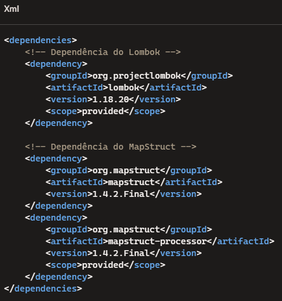

# Projeto Java Maven
Este projeto foi criado do zero utilizando Maven. Ele demonstra o uso das bibliotecas MapStruct e Lombok para simplificar o desenvolvimento de aplicações Java.

Funcionalidades
MapStruct: Facilita a mapeação de objetos entre diferentes classes, tornando o código mais limpo e fácil de manter.

Lombok: Reduz o boilerplate code ao gerar automaticamente getters, setters, construtores, métodos toString, equals e hashCode, entre outros.

Dependências
O projeto inclui as seguintes dependências no pom.xml:

### Anotações do Lombok
Algumas das principais anotações do Lombok utilizadas neste projeto:

@Getter: Gera automaticamente os métodos getter para todos os campos da classe.

@Setter: Gera automaticamente os métodos setter para todos os campos da classe.

@EqualsAndHashCode: Gera automaticamente os métodos equals e hashCode com base nos campos da classe.

@NoArgsConstructor: Gera automaticamente um construtor sem argumentos.

@ToString: Gera automaticamente o método toString com base nos campos da classe.

@Data: um resumo de todas as anteriores.

### Notações do MapStruct
As anotações @Mapper e @Mapping do MapStruct permitem mapear de forma automática
os valores de um objeto UserDTO (formulário) para um objeto UserModel (formato banco de dados). Isso agiliza o processo de criação do código e diminui o tempo gasto com tarefas repetitivas de mapeamento manual.

---
### Exemplo de Código
Aqui está um exemplo de como o MapStruct foi usado para mapear entre as classes UserDTO e UserModel:

### Benefícios

1. Agilidade no Desenvolvimento:

   * As anotações @Mapper e @Mapping eliminam a necessidade de escrever manualmente o código de mapeamento, o que reduz o tempo de desenvolvimento.

2. Redução de Erros:

   * Ao automatizar o mapeamento de campos entre objetos, o MapStruct reduz a possibilidade de erros humanos, garantindo consistência nos dados.

3. Manutenibilidade:

   * O código gerado pelo MapStruct é mais fácil de manter e entender, pois as regras de mapeamento estão claramente definidas nas anotações.

4. Desempenho:

   * O MapStruct gera código de mapeamento eficiente em tempo de compilação, resultando em um melhor desempenho em comparação com soluções de reflexão em tempo de execução.
